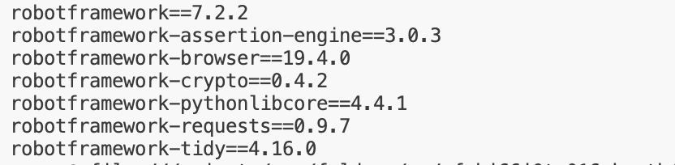

# Tehtävä 1: Asennukset

Tässä tehtävässä kuvataan, kuinka asensin tarvittavat työkalut ja kirjastot terveyspäiväkirja-projektiin.

Tämän tehtävän tavoitteena oli asentaa ja ottaa käyttöön Robot Framework ja siihen liittyvät lisäkirjastot seuraavien ohjeiden mukaisesti:  
🔗 [GitHub: 01. Asennukset](https://github.com/sakluk/projekti-terveyssovelluksen-kehitys/blob/main/ohjeet_testaus/01_asennukset.md)

---

## Asennetut työkalut

- **Robot Framework** – Testiautomaatioalusta  
- **Browser Library** – Web-sovellusten testaukseen  
- **Requests Library** – REST API -testaamiseen  
- **CryptoLibrary** – Salaustestaukseen  
- **Robotidy** – Koodiformatointiin  

### Saatu tulos

---

# Tehtävä 2: Kirjautumistesti

Tässä tehtävässä automatisoin kirjautumistestin omalle terveyspäiväkirja-sovellukselleni käyttäen Robot Frameworkia ja Browser-kirjastoa.

🔗 [GitHub: 02. Käyttöliittymän (GUI) testaus](https://github.com/sakluk/projekti-terveyssovelluksen-kehitys/blob/main/ohjeet_testaus/02_gui_testaus.md)

---

## Käytetyt tiedostot

- `resources/Keywords.robot` – sisältää muuttujat `${Username}` ja `$Password`

- `tests/login-test.robot` – varsinainen testitapaus

---

## Saatu tulos

Testi suoritettu onnistuneesti. Alla on kuvankaappaus onnistuneesta testistä:

---

## Havainnot

- Robot Framework toimii hyvin kirjautumistestissä
- Browser-kirjastossa tulee käyttää `css=` tai `xpath=` valitsimia, ei esim. `class=`

---

# Tehtävä 3: Web Form -elementtien testaus

Tässä tehtävässä testattiin Seleniumin tarjoamaa esimerkkilomaketta:  
🔗 [Web Form](https://www.selenium.dev/selenium/web/web-form.html)

Ohjeistus löytyi samasta oppaasta kuin Tehtävä 2:  
🔗 [GitHub: 02. GUI-testaus](https://github.com/sakluk/projekti-terveyssovelluksen-kehitys/blob/main/ohjeet_testaus/02_gui_testaus.md)

---

## Tavoitteet

- Tekstikenttä, salasanakenttä, tekstialue
- Dropdown (select)
- Datalist
- Tiedoston valinta (file input)
- Checkbox ja radiobutton
- Lomakkeen lähetys ja tarkistus

---

## Käytetyt tiedostot

- `tests/webform-test.robot` – kaikki kentät täyttävä testi
- `resources/testfile.txt` – ladattava testitiedosto

---

## Tulokset

Testi suoritettu onnistuneesti. Alla kuvankaappaus:

---

## Mahdolliset ongelmat

- Elementtejä, joilla on sama `name`, pitää tarkentaa `id`:n tai `css=`-valitsimien avulla
- Tiedostonsyöttö toimii vain oikealla `Upload File By Selector` -avainsanalla

---

# Tehtävä 4: Päiväkirjamerkinnän lisääminen

Tässä tehtävässä automatisoitiin sovelluksen lomake, jolla käyttäjä lisää uuden päiväkirjamerkinnän.

---

## Tavoitteet

- Täyttää kentät (päivämäärä, mieliala, energiataso, stressitaso, uni, muistiinpanot, tavoitteet)
- Klikata “Save My Entry” -painiketta
- Tarkistaa, että popup ilmestyy

---

## Tiedostot

- `resources/entry_data.robot` – muuttujat syötettävistä kentistä
- `tests/new-entry-test.robot` – testi päiväkirjamerkinnän tekemiseksi

---

## Tulokset

Testi meni läpi onnistuneesti ja yhteenvetopopup ilmestyi:

---

## Huomiot

- HTML-elementtien `id`-kentät toimivat hyvin valitsimina (`id=entry_date` jne.)
- `css=input.createEntry` painikkeen klikkaus toimii testin lopuksi
- Popupin otsikko `"Your Diary Summary"` toimi hyvin varmistuksena.

---

## Tekoälyn käyttö
Tekoälyä on käytetty tässä tehtävässä mahdollisten virheiden tunnistamiseen ja korjaamiseen.